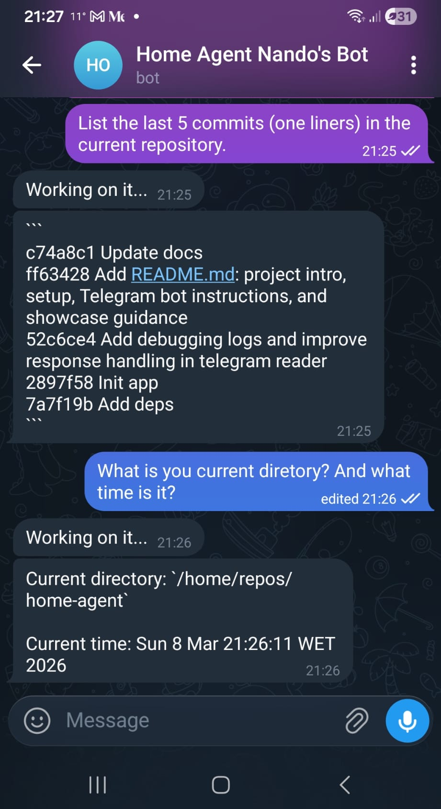
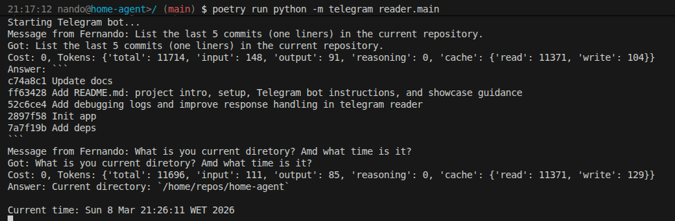

# Home Agent Telegram Bot

Welcome to my new project, the **Home Agent project**! This is an open-source Telegram bot designed to help automate tasks,
and learn about bot development.

## Features

- Built with Python and Poetry
- Easily extendable and open for contributions
- Designed for beginners and enthusiasts

## Getting Started

### Prerequisites

- Python 3.11+ (not tested, but expected to run on 3.9+)
- Basic knowledge of Poetry
- [Opencode AI cli](hhttps://opencode.ai/)
- A Telegram bot created (see below)

### Creating a Telegram Bot

1. Open Telegram and search for [@BotFather](https://t.me/botfather).
2. Start a conversation and use `/newbot` to create your bot.
3. Follow the instructions and save your bot token.
4. Paste the token into your `.env` file.

### Set up your and run

1. Install dependencies with Poetry:
   ```bash
   poetry install --no-root
   ```
2. Copy `.env.sample` to `.env` and fill in your Telegram Bot credentials.
3. Start the app:
   ```bash
   poetry run python -m telegram_reader.main
   ```

## Restarting the service remotely

This project can be installed as a user-scoped `systemd` service and restarted with a Telegram command.

### Environment variables

Add these values to your `.env` file:

```bash
TELEGRAM_BOT_TOKEN=your-token-here
TELEGRAM_ADMIN_USER_IDS=123456789
RESTART_COMMAND=bash ./scripts/restart-home-agent.sh
```

- `TELEGRAM_ADMIN_USER_IDS` is a comma-separated list of Telegram user IDs allowed to run `/restart`
- `RESTART_COMMAND` is the fixed local script that restarts the service

You can discover your Telegram user ID by sending this command to the bot:

```text
/whoami
```

### Install the user service

Copy the service file into your user `systemd` directory:

```bash
mkdir -p ~/.config/systemd/user
cp systemd/home-agent.service ~/.config/systemd/user/home-agent.service
```

If Poetry is installed elsewhere, update `ExecStart` in `systemd/home-agent.service` first.

The provided service file also loads environment variables from `%h/repos/home-agent/.env`.

Then enable and start the service:

```bash
systemctl --user daemon-reload
systemctl --user enable --now home-agent.service
```

To keep user services available after logout, enable lingering once:

```bash
loginctl enable-linger "$USER"
```

### Restart via Telegram

Send this command to the bot:

```text
/restart
```

If your Telegram user ID is listed in `TELEGRAM_ADMIN_USER_IDS`, the bot will run the fixed restart script and `systemd --user` will restart the service.
If the user is not authorised, the bot stays silent and only logs the attempt locally.

### Example in Action

Below you can see Home Agent in use:

**Telegram request:**


**App response:**


## Contributing

This project is open for contributions! Whether you're a beginner or an experienced developer, your input is welcome. Please follow best practices and submit pull requests for review.
